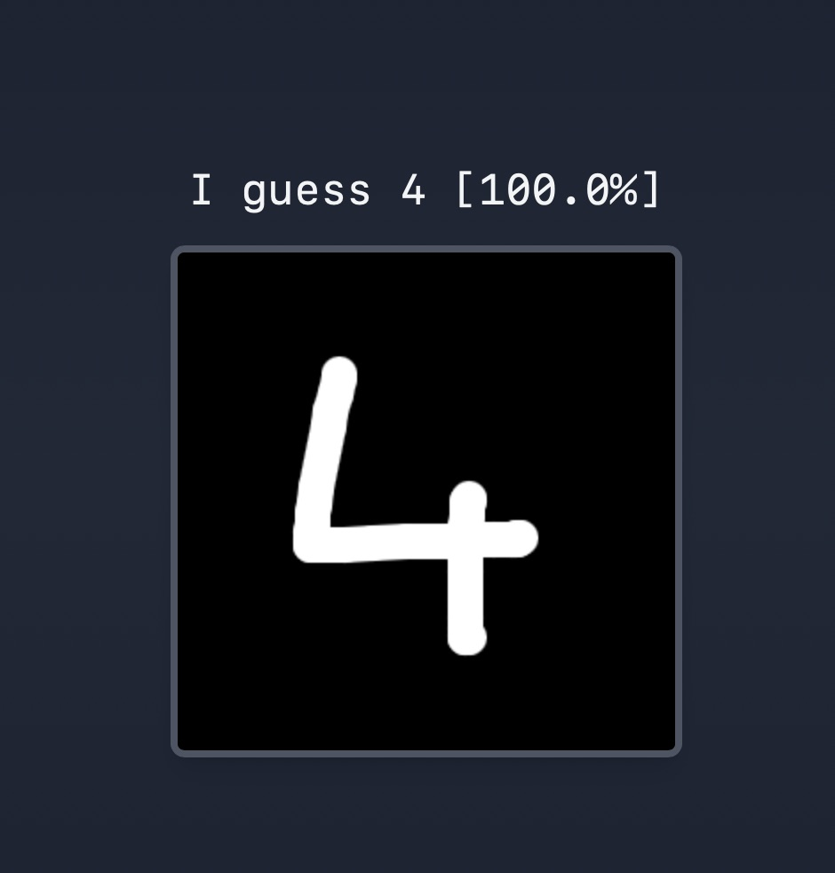
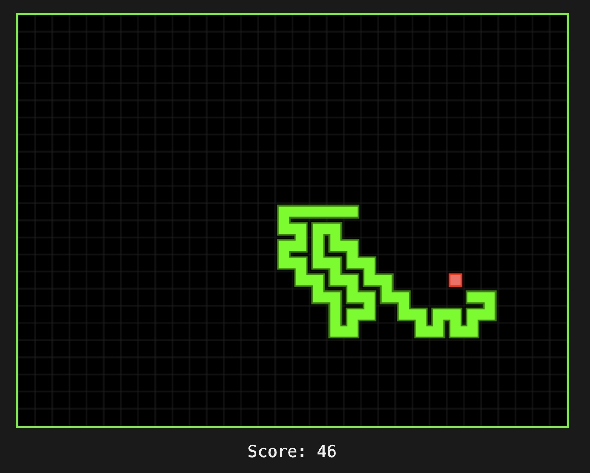

# Browser-Based ML Demos
[Try them out live](https://ai.timmoth.com)

A collection of browser-based machine learning experiments, built to explore machine learning techniques and for fun. 

## Projects

## Digit Draw: Handwritten Digit Recognition
Draw a digit (0–9) on a canvas, and a convolutional neural network trained on the MNIST dataset will try to guess it in real time.
#### [Live demo](https://ai.timmoth.com/demos/digit_draw/)
#### [Source code](https://github.com/Timmoth/Ai/tree/main/src/digit_draw)

  

## Doodle Draw: Recognizing 50M+ Sketches
Doodle objects on a canvas and predicts what you’re drawing from 380+ categories.
#### [Live demo](https://ai.timmoth.com/demos/doodle_draw/)
#### [Source code](https://github.com/Timmoth/Ai/tree/main/src/doodle_draw)

  

## Snake AI: Deep Q-Learning in Action
Snake agent trained using Deep Q-Networks (DQN) 
#### [Live demo](https://ai.timmoth.com/demos/snake_ai/)
#### [Source code](https://github.com/Timmoth/Ai/tree/main/src/snake_ai)

  

