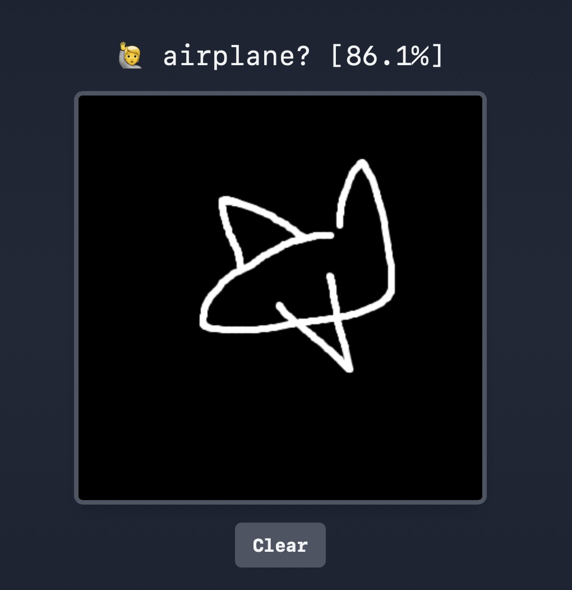

# Doodle Draw - A TensorFlow.js Doodle Recognition Project

## [Live demo](https://ai.timmoth.com/demos/doodle_draw/)

Doodle Draw is a browser based interactive demo that allows you to draw doodles on a canvas, and it will predict what doodle you're drawing using a TensorFlow convolutional neural network trained on the ~50 million doodles from the google Quick Draw! dataset.

<p align="center">
  
</p>

## Technologies Used  
- **Python**
- **JavaScript** 
- **TensorFlow**
- **HTML5 Canvas**
- **Quick Draw! dataset**

## How It Works  
### 1. Data Extraction (train/extract.py)
- Read the .ndjson files from the Google QuickDraw dataset.
- Each doodle is a sequence of strokes (drawing key in JSON).
- Rasterize strokes into 64x64 grayscale images (white strokes on black background).
- Flatten each image into a 1D vector.
- Data is written into memory-mapped numpy arrays (flattened image data: X.dat and integer labels: y.dat).
- Data is shuffled while writing.

### 2. Verification (train/verify_extraction.py)
- Confirms all classes are present in y.dat.
- Generates sample PNGs from random indices to visually check data quality.
- Prints the first index in the shuffled data after all classes have been seen.
- Generally ensure the dataset pipeline is correct before heavy training.

### 3. Training (train/train.py)
- Uses the memmapped dataset (X.dat, y.dat).
- Builds a CNN with progressively deeper convolutional layers:
```python
Sequential([
    Input(shape=(64, 64)),
    Conv2D(32), BatchNorm(), MaxPool(),
    Conv2D(64), BatchNorm(), MaxPool(),
    Conv2D(128), BatchNorm(), MaxPool(),
    GlobalAvgPooling(),
    Dense(512), Dropout(.4),
    Dense(NUM_CLASSES)# 340+ object categories
])
```
- Data augmentation: random rotations, translations, zooms.
- ModelCheckpoint: saves checkpoints each epoch.
- EarlyStopping: stops if validation loss stops improving.
- ReduceLROnPlateau: lowers learning rate if stuck.
- TFJSCheckpoint: exports the model to TensorFlow.js format after each epoch.
- Final trained model is saved

[Check out Sebastian Lague's video on CNN's](https://www.youtube.com/watch?v=hfMk-kjRv4c)